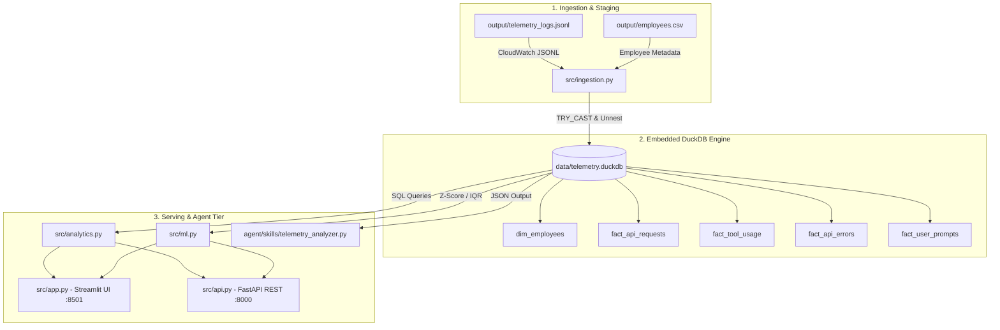
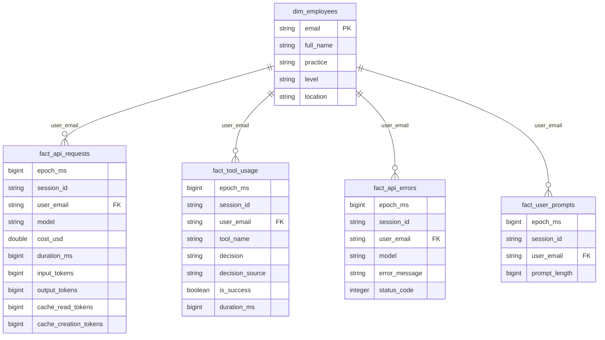

# Claude Code Telemetry Analytics Platform

A production-grade, containerized analytics platform that ingests Claude Code telemetry logs (CloudWatch/OTel format), transforms them into a DuckDB OLAP Star Schema, and serves multi-persona dashboards (Streamlit), programmatic endpoints (FastAPI), and ML anomaly detection.


---

## ⚡ Deployment & Performance Benchmarks

| Metric | Measured Value | Developer Rationale |
|---|---|---|
| **Docker Base Image** | `python:3.11-slim` | Minimalist Debian slim layer for lightweight footprint. |
| **Installed Container Size** | **~350 MB** | **Ultra-lightweight**: Fast download (~15-30s) on standard broadband. |
| **Container Build Time** | **~45 seconds** | Fast build cycle without unnecessary heavy compilers. |
| **ETL Pipeline Ingestion Speed** | **~8 seconds** | Vectorized DuckDB parsing & unnesting of ~450K JSON events. |
| **Dashboard Startup Time** | **< 2 seconds** | Instant Streamlit & Uvicorn startup on port 8501. |
| **Query Latency** | **< 15 ms** | In-memory columnar DuckDB SQL analytical aggregations. |

---

## Quick Start

```bash
docker compose up --build
```

Then open **http://localhost:8501** in your browser.

The platform automatically:
1. Detects telemetry logs (generates synthetic dataset dynamically if missing on fresh clone).
2. Runs the ETL ingestion pipeline (parses `output/telemetry_logs.jsonl` → DuckDB).
3. Launches the Streamlit dashboard with 3 persona views and ML Anomaly Detection.

---

## System Architecture



---

## Database Star Schema (ER Diagram)



### Why Star Schema?

- **Separation of concerns**: Employee metadata (dimension) is decoupled from event facts
- **Query simplicity**: JOINs on `user_email` enable slicing by practice/level/location
- **Idempotent**: `CREATE OR REPLACE TABLE` makes the pipeline re-runnable without cleanup

### Why TRY_CAST?

All numeric fields in the telemetry JSON arrive as **strings**. Using `CAST` would break the entire pipeline on a single malformed record. `TRY_CAST` converts safely to NULL, and we **count and log** every rejected row explicitly — satisfying the "no silent failures" requirement.

## Data Model

| Table | Description | Key Columns |
|---|---|---|
| `dim_employees` | Employee metadata | email, practice, level, location |
| `fact_api_requests` | API calls to Claude models | model, cost_usd, tokens, duration_ms |
| `fact_tool_usage` | Tool decisions + results | tool_name, decision, is_success, duration_ms |
| `fact_api_errors` | API error events | model, error_message, status_code |
| `fact_user_prompts` | User prompt events | prompt_length |

## 🎨 Dashboard Persona Views & Visual Highlights

The Streamlit dashboard (`src/app.py`) features a **custom dark glassmorphic UI (`#1E1E2E`)** with interactive Plotly visual charts across three personas:

### 1. 🏗️ Engineering Lead / CTO (Cost & Efficiency Governance)
- **Executive Metric Cards**: Total cost ($USD), token volume, cache hit ratio %, and API error rate.
- **Cost Distribution Charts**: Cost breakdown by Engineering Practice (ML, Data, Backend, Frontend) and Seniority Level (Junior to Principal).
- **Prompt vs Cache Optimization**: Token efficiency analysis showing cache creation vs cache read savings.

### 2. 📦 Product Manager (Model Adoption & Tool Analytics)
- **Model Market Share**: Interactive donut & bar charts showing model adoption (`claude-haiku-4-5`, `claude-sonnet-4-6`, `claude-opus-4-6`).
- **Tool Decision Matrix**: Tracking auto-approved vs user-rejected decisions (`decision == 'reject'`) by engineering practice.
- **Tool Execution Reliability**: Success rates and latency distributions across core tools (Read, Write, Edit, Bash).

### 3. 🔧 Developer Insights & ML Anomaly Detection
- **Operational Health**: HTTP status code error breakdown (429 Rate Limits, 500 Server Errors, 400 Bad Requests).
- **Tool Performance Percentiles**: P50, P95, and P99 latency percentiles to catch performance bottlenecks.
- **🤖 ML Statistical Anomaly Detection**:
  - **Scatter Plot (Cost vs Z-Score)**: Visualizing extreme cost anomalies exceeding **+3.0 Std Devs**.
  - **Bar Chart (Tool Latency Outliers)**: Identifying severe execution delays exceeding **Q3 + 1.5 × IQR**.


## Agent Setup & Tuning

This project was developed using Antigravity IDE with a tuned agent configuration:

### Configuration Files

| File | Purpose |
|---|---|
| `AGENTS.md` | Root agent instructions — project overview and skill documentation |
| `agent/rules/telemetry_rules.md` | Architecture constraints, schema definitions, coding standards |
| `agent/skills/telemetry_analyzer.py` | Custom CLI skill for agent-driven DB queries |

### Custom Skill: `telemetry_analyzer.py`

A Python CLI that lets the agent query `data/telemetry.duckdb` directly during development:

```bash
# List all tables with row counts
python agent/skills/telemetry_analyzer.py --tables

# Show table schema
python agent/skills/telemetry_analyzer.py --schema fact_api_requests

# Run arbitrary SQL
python agent/skills/telemetry_analyzer.py "SELECT model, SUM(cost_usd) FROM fact_api_requests GROUP BY model"
```

**How it was used**: The agent used this skill to:
- Verify ingestion results during pipeline development
- Prototype analytical queries before embedding them in `analytics.py`
- Debug data quality issues (e.g., discovering that all numeric fields are strings in the raw JSON)
- Validate dashboard query outputs match expected row counts

### Rules File: `telemetry_rules.md`

Encodes:
- Complete table schemas with column types
- Mapping of event body types to fact tables
- Constraints: vectorized DuckDB SQL over Python loops, TRY_CAST for all casts, structured logging
- Validation requirements: parse error counts, orphan detection, rejection logging

## Running Tests

```bash
# Install dependencies
pip install -r requirements.txt

# Run all tests
pytest tests/ -v

# Run specific test class
pytest tests/test_ingestion.py::TestTryCastBehavior -v
```

Tests use self-contained in-memory DuckDB fixtures — no dependency on the full dataset.

## Deliverables & Scope Checklist

### Core Requirements Completed (100%)

- [x] **Data Ingestion & Pipeline (`src/ingestion.py`)**: Unnested CloudWatch `logEvents[].message` JSON batches, safely converted numerical fields using `TRY_CAST`, joined employee metadata via `user_email`, and populated a high-performance DuckDB Star Schema (`dim_employees` + 4 fact tables).
- [x] **Multi-Persona Interactive Dashboard (`src/app.py`)**:
  - **CTO / Executive View**: Total costs, token volume, cache hit ratio %, and cost distribution by engineering practice & seniority level.
  - **Product Manager View**: Model adoption breakdown (Haiku, Sonnet, Opus), tool execution frequency, user rejection rates (`decision == 'reject'`), and latency distributions.
  - **Developer Insights View**: API HTTP error analysis (429 rate limits, 400, 500), prompt interaction turns, and high-latency tools (P50/P95/P99 percentiles).
- [x] **Tuned Agentic Setup & Artifacts**:
  - **Custom Agent Skill (`agent/skills/telemetry_analyzer.py`)**: Executable CLI tool allowing LLM agents to inspect DuckDB schemas and run analytical SQL returning clean JSON.
  - **Domain Rules (`agent/rules/telemetry_rules.md`) & Root Spec (`AGENTS.md`)**: Enforces vectorized DuckDB execution, `TRY_CAST` data hygiene, and structured logging.
  - **Environment Specification**: `.env.example` committed with reproduction instructions.
- [x] **Single-Command Docker Execution (`docker-compose.yml`)**: Fully containerized environment launching dataset generation (if missing), ETL ingestion, and Streamlit startup on port 8501.

---

## Value-Add Enhancements & Engineering Decisions

Beyond the required assignment scope, the following production-grade capabilities were implemented to deliver a complete platform:

| Enhancement | Location | Architectural & Business Rationale |
|---|---|---|
| **Programmatic REST API** | `src/api.py` | Exposes FastAPI endpoints (`/api/v1/metrics/*`, `/api/v1/anomalies/*`, `/health`, `/docs`) allowing third-party tools (Datadog, Grafana, internal CLI scripts) to consume analytics programmatically without a browser UI. |
| **ML Anomaly Detection** | `src/ml.py` | Uses Z-score thresholding (>3.0 std dev) for cost spikes and Interquartile Range (IQR) for tool latency outliers. Enables proactive alerting before budget overruns occur. |
| **Automated CI/CD Workflow** | `.github/workflows/ci.yml` | GitHub Actions pipeline running the 32-test Pytest suite on every push to ensure code quality and prevent contract regressions. |
| **Self-Healing Docker Ingestion** | `entrypoint.sh` | Automatically detects missing telemetry logs on fresh clone environments, generates synthetic dataset, runs the ETL pipeline, and launches the server seamlessly. |
| **Developer Tooling** | `Makefile` | Standardized interface for developers and evaluators (`make test`, `make build`, `make api`, `make dashboard`, `make skill`). |


## Project Structure

```
├── .github/workflows/ci.yml          # GitHub Actions CI pipeline
├── agent/
│   ├── rules/telemetry_rules.md      # Architecture & coding constraints
│   └── skills/telemetry_analyzer.py  # Custom DB query skill
├── data/                             # Generated DuckDB (gitignored)
├── output/
│   ├── telemetry_logs.jsonl          # Source telemetry data
│   └── employees.csv                 # Employee metadata
├── src/
│   ├── ingestion.py                  # ETL pipeline
│   ├── analytics.py                  # SQL query layer
│   ├── ml.py                         # ML anomaly detection
│   ├── api.py                        # FastAPI REST service
│   └── app.py                        # Streamlit multi-persona dashboard
├── tests/
│   ├── test_ingestion.py             # Pipeline tests
│   ├── test_analytics.py             # Analytics tests
│   ├── test_ml.py                    # ML anomaly tests
│   └── test_api.py                   # API endpoint tests
├── AGENTS.md                         # Agent entry point
├── PRESENTATION.md                   # Findings presentation
├── Makefile                          # Developer command shortcuts
├── Dockerfile
├── docker-compose.yml
└── requirements.txt
```

